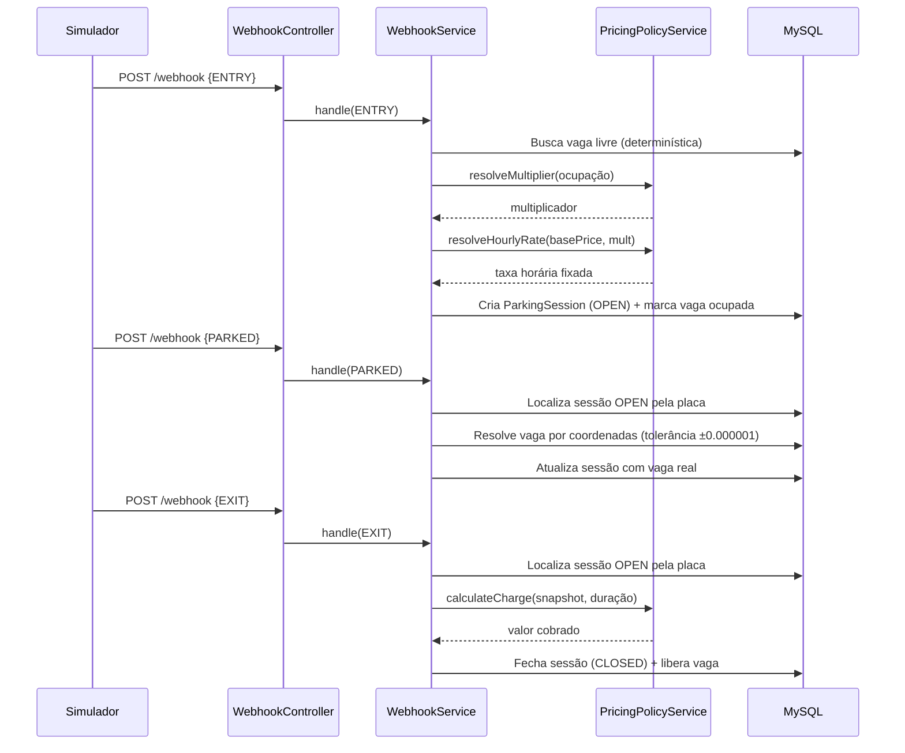
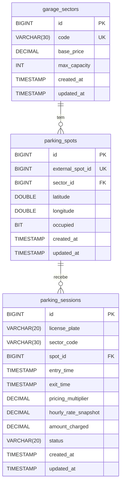

# Arquitetura — Parking Garage

> Para instruções de execução, endpoints e configuração, consulte o [README.md](../README.md).

---

## Visão Geral

O sistema é um backend **Spring Boot** que recebe eventos de um simulador de garagem via webhook, mantém o estado das vagas e sessões de estacionamento, aplica pricing dinâmico e disponibiliza consulta de receita por setor.

```
Simulador  ──(POST /webhook)──►  Parking Garage API  ──►  MySQL
           ◄──(GET topology)──
```

---

## Módulos e Responsabilidades

| Pacote | Responsabilidade |
|---|---|
| `config` | Bootstrap do HTTP client, propriedades do simulador e carga inicial da topologia |
| `controller` | Recebe requisições HTTP e delega para os serviços |
| `dto` | Contratos de entrada/saída (webhook, simulador, receita) |
| `entity` | Mapeamento JPA das três tabelas principais |
| `exception` | Tradutor centralizado de erros (`GlobalExceptionHandler`) |
| `integration` | `SimulatorClient` — chamadas REST ao simulador |
| `repository` | Interfaces Spring Data JPA |
| `service` | Regras de negócio e orquestração |

---

## Fluxo de Eventos do Webhook



---

## Pricing Dinâmico

A lógica de precificação está concentrada em `PricingPolicyService` e é **imutável após o ENTRY** (snapshot pattern).

### Multiplicador por Ocupação

| Taxa de Ocupação | Multiplicador |
|---|---|
| < 25% | 0.90 (–10%) |
| 25% – 50% | 1.00 (padrão) |
| 51% – 75% | 1.10 (+10%) |
| > 75% | 1.25 (+25%) |

### Cálculo do Valor Final

1. **`resolveMultiplier`** — avalia `occupiedSpots / maxCapacity`
2. **`resolveHourlyRate`** — `basePrice × multiplier` (congelado no ENTRY)
3. **`calculateCharge`** — período ≤ 30 min → gratuito; acima disso, arredonda para a hora cheia acima

---

## Modelo de Dados



### Índices

| Índice | Colunas | Propósito |
|---|---|---|
| `idx_parking_sessions_plate_status` | `license_plate, status` | Busca rápida de sessão aberta por placa |
| `idx_parking_sessions_exit_sector` | `exit_time, sector_code` | Agregação de receita por setor/data |

---

## Inicialização da Garagem

No startup (`StartupDataLoader → GarageBootstrapService`), a API consome `GET http://localhost:3000/garage` do simulador e persiste a topologia (setores → vagas) no MySQL via `SimulatorClient`. Execuções subsequentes são idempotentes (upsert via unique constraints).

---

## Tratamento de Erros

`GlobalExceptionHandler` traduz exceções do domínio para respostas HTTP padronizadas:

| Exceção | Status HTTP |
|---|---|
| `ResourceNotFoundException` | 404 |
| `BusinessException` | 422 |
| `MethodArgumentNotValidException` | 400 |
| Demais | 500 |

---

## Testes

Os testes unitários cobrem exclusivamente `PricingPolicyService`, validando os quatro intervalos do multiplicador, o período gratuito de 30 minutos e o arredondamento de horas. O banco em testes é H2 (in-memory) com schema gerenciado pelo Flyway.

---

## Decisões de Design

| Decisão | Racional |
|---|---|
| **Snapshot do preço no ENTRY** | Congela o valor no momento da entrada, isolando a sessão de variações de ocupação posteriores |
| **Vaga determinística no ENTRY** | Ordenação por `sector_code ASC, external_spot_id ASC` garante comportamento reproduzível |
| **Tolerância de coordenada** | `±0.000001` (~11 cm) absorve imprecisão de floating-point sem ambiguidade |
| **`ddl-auto: validate`** | Flyway é a única fonte de verdade do schema; o Hibernate apenas valida |
| **Spring RestClient** | API fluente do Spring 6.1, reduz boilerplate frente a `RestTemplate` ou WebClient |
